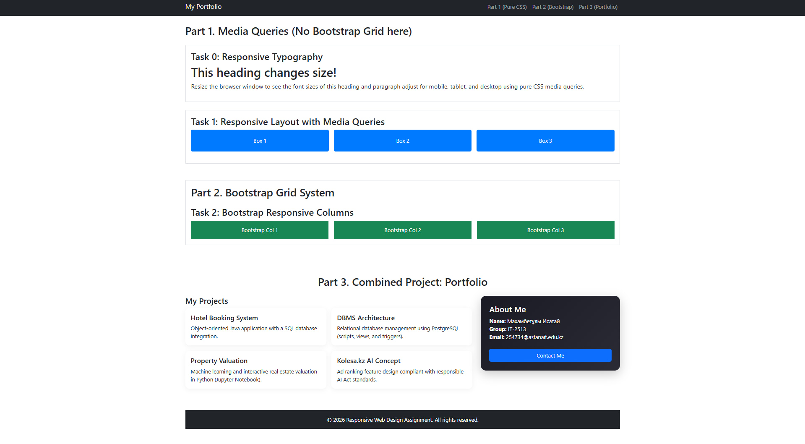

# Assignment 3: Responsive Web Design

## Project Overview
This repository contains a multi-page responsive website developed as part of Assignment 3. The project demonstrates the implementation of semantic HTML5, custom CSS (Flexbox and Grid), and the Bootstrap 5 framework to ensure full responsiveness across mobile, tablet, and desktop devices. This is a solo project developed entirely from scratch.

## Live Demo
[Insert link to GitHub Pages or Netlify here]

## Developer
**Isatay Mahambetuly**
* **Group:** IT-2513
* **Email:** 254734@astanait.edu.kz

## Features & Implementation
* **HTML Structure & Semantics:** Built a semantic HTML5 architecture (`<header>`, `<main>`, `<footer>`, `<nav>`) and developed all required pages (`index.html`, `products.html`, `compare.html`, `about.html`, `contact.html`).
* **CSS Styling & Layouts:** Configured global styles using CSS variables, constructed layouts with CSS Flexbox and Grid, and implemented smooth interactive hover effects and custom UI components.
* **Bootstrap & Responsiveness:** Integrated the Bootstrap 5 Grid System, built a responsive navigation bar, designed robust forms, and wrote custom Media Queries to ensure a seamless experience on mobile and tablet displays.

## Project Screenshots

### Desktop View

## Technologies Used
* HTML5
* CSS3 (Flexbox, CSS Grid, Media Queries)
* Bootstrap 5.3

## Local Setup
1. Clone this repository:
   `git clone [Insert repository link]`
2. Open the project folder in your IDE (e.g., VS Code).
3. Open `index.html` using Live Server or directly in a web browser.